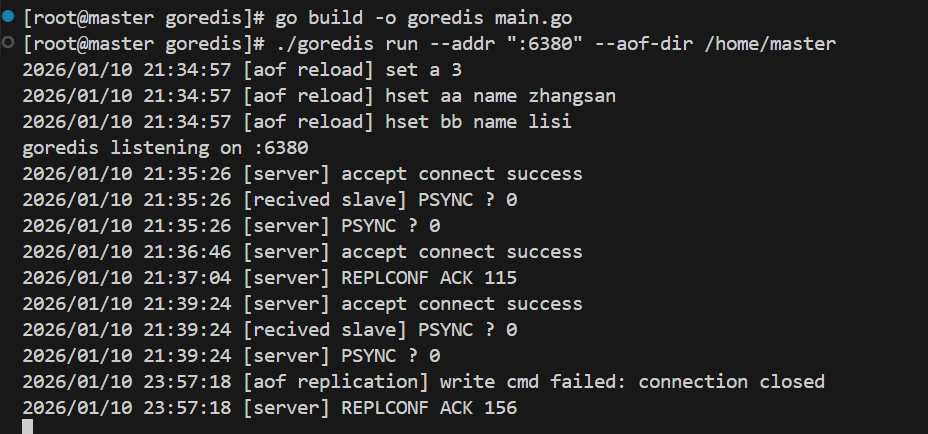
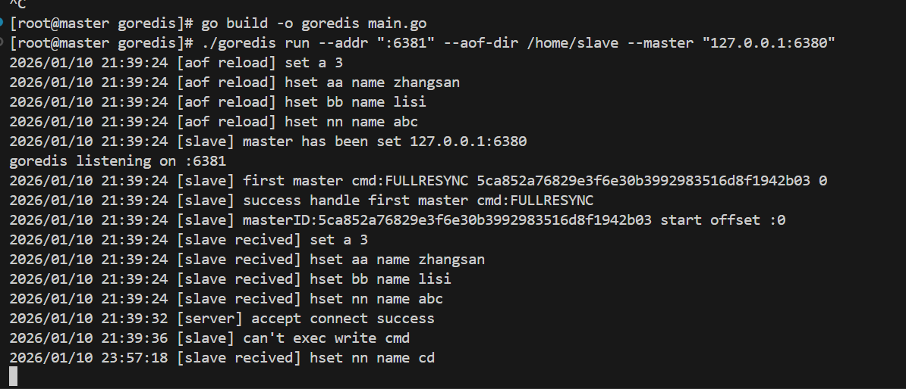
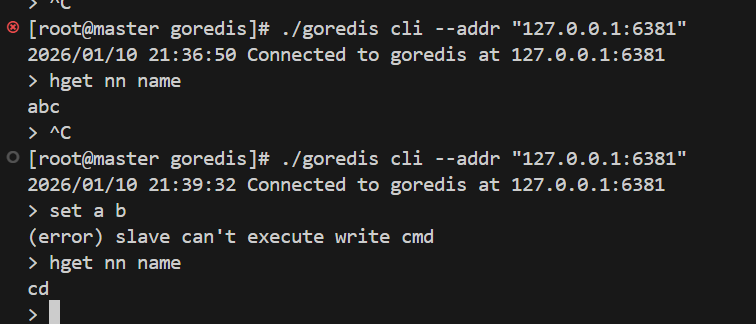

# GoRedis

一个使用 Go 语言实现的 Redis-like 项目，旨在学习和复刻 Redis 的核心机制。

## 项目介绍

GoRedis 是一个实验性的 Redis 兼容服务器，使用 Go 语言实现，专注于 Redis 核心功能的学习和复刻。该项目的目标是帮助开发者深入理解 Redis 的内部实现原理，包括网络协议、数据结构、命令执行、主从同步等核心组件。

本项目适用于：
- Go 语言学习者，希望了解实际项目开发经验
- 中间件爱好者，想学习 Redis 类似系统的实现原理
- Redis 原理学习者，通过阅读简洁的代码加深对 Redis 内部机制的理解

**注意：此项目仅供学习参考，不建议用于生产环境。**

## 功能特性

- RESP (Redis Serialization Protocol) 协议解析与编码
- TCP 长连接与连接管理
- 多数据库支持 (当前默认支持 0 号数据库)
- 核心数据结构实现：
  - 字符串 (String)：SET, GET, INCR, DECR, APPEND 等命令
  - 哈希表 (Hash)：HSET, HGET, HDEL, HGETALL 等命令
  - 列表 (List)：LPUSH, RPUSH, LPOP, RPOP, LRANGE 等命令
  - 集合 (Set)：SADD, SREM, SMEMBERS, SINTER 等命令
  - 有序集合 (Sorted Set)：ZADD, ZRANGE, ZSCORE, ZRANK 等命令
- AOF (Append Only File) 持久化支持
- 主从复制功能
- 基于跳表(SkipList)的有序集合实现

## 项目结构

```
goredis/
├── cmd/                    # CLI 命令入口
│   ├── cli.go              # 客户端命令行界面
│   ├── run.go              # 服务器启动命令
│   └── root.go             # 根命令
├── internal/               # 内部实现
│   ├── command/            # 命令实现 (String, Hash, List, Set, ZSet)
│   ├── common/             # 通用工具函数
│   ├── data/               # 数据结构的具体实现
│   ├── database/           # 数据库操作接口
│   ├── persistant/         # 持久化实现
│   ├── resp/               # RESP 协议解析与编码
│   ├── server/             # 服务器核心逻辑
│   └── types/              # 类型定义
├── pkg/                    # 可复用的公共包
│   ├── connection/         # 连接管理
│   ├── datastruct/         # 底层数据结构 (SkipList, Dict, List)
│   └── parser/             # RESP 协议解析器
└── scripts/                # 脚本工具
```

### 核心模块说明

- **connection**: 处理 TCP 连接的抽象层，管理客户端连接状态
- **parser**: RESP 协议解析器，负责将字节数组转换为命令结构
- **resp**: RESP 协议编码器，将结果编码为 Redis 协议格式
- **command**: 命令注册中心，处理不同 Redis 命令的执行逻辑
- **data**: 实现 Redis 各种数据类型 (String, Hash, List, Set, ZSet)
- **datastruct**: 底层数据结构实现，如跳表、字典、双向链表等
- **server**: 服务器主循环，处理客户端请求和响应
- **database**: 数据库抽象层，管理键值对存储

## 核心设计说明

### TCP 连接模型
服务器采用典型的多线程模型，每个客户端连接由独立的 goroutine 处理。通过 [connection.TCPConnection](file:///d:/projects/goredis/pkg/connection/connection.go#L10-L14) 抽象处理读写操作。

### 数据结构设计
GoRedis 在 [internal/data](file:///d:/projects/goredis/internal/data) 目录下实现了 Redis 的各种数据类型，每个数据类型都实现了 [types.RedisData](file:///d:/projects/goredis/internal/types/types.go#L35-L44) 接口，提供了统一的 API。以下是各种数据结构的设计思路：

| 数据结构 | 文件 | 设计思路说明 |
|---------|------|-------------|
| String | [string.go](file:///d:/projects/goredis/internal/data/string.go) | 封装了字节数组，支持 INCR/DECR 等操作，内部存储为 `[]byte`，实现了原子性自增减操作 |
| HashMap | [hashmap.go](file:///d:/projects/goredis/internal/data/hashmap.go) | 基于 Go 的 `map[string][]byte` 实现，提供 HSET/HGET/HDEL 等操作，内部使用字典存储 field-value 对 |
| Set | [set.go](file:///d:/projects/goredis/internal/data/set.go) | 使用动态编码策略，小集合时使用 [IntSet](file:///d:/projects/goredis/pkg/datastruct/intset.go#L3-L7)（内存高效存储整数），大集合或包含非整数时使用 [HashSet](file:///d:/projects/goredis/pkg/datastruct/hashset.go#L5-L8)（O(1) 查找性能）。这种设计平衡了内存使用和操作性能 |
| QuickList | [quicklist.go](file:///d:/projects/goredis/internal/data/quicklist.go) | 基于双向链表实现，每个节点是一个 [ListPack](file:///d:/projects/goredis/pkg/datastruct/listpack.go#L12-L16)（紧凑的序列化结构，无需指针即可访问元素），结合了链表插入删除高效的特性和数组内存紧凑的优点 |
| ZSet | [zset.go](file:///d:/projects/goredis/internal/data/zset.go) | 使用双索引结构：[SkipList](file:///d:/projects/goredis/pkg/datastruct/skiplist.go#L25-L30) 提供按分数排序和范围查询的能力，[Dict](file:///d:/projects/goredis/pkg/datastruct/dict.go#L9-L13) 提供 O(1) 的成员查找。同时在数据量少时使用 [ListPack](file:///d:/projects/goredis/pkg/datastruct/listpack.go#L12-L16) 存储以节省内存 |

### RESP 请求/响应处理流程
```
TCP Connection -> Parser -> Command Line -> Database Execution -> Reply -> RESP Encoder -> TCP Connection
```

### 命令执行链路
1. 接收客户端发送的字节流
2. 通过 [parser.Parser](file:///d:/projects/goredis/pkg/parser/parser.go#L11-L15) 解析为命令行结构 (`[][]byte`)
3. 根据命令名称查找注册的处理器
4. 执行命令并获取结果
5. 将结果编码为 RESP 格式返回给客户端


### AOF 持久化设计

AOF (Append Only File) 持久化机制通过将每个写命令追加到文件末尾来保证数据的持久性。AOF 实现主要包括以下几个方面：

1. **后台异步刷盘**：
   - 使用独立的 goroutine 处理 AOF 写入逻辑
   - 通过 channel 接收写命令，批量写入磁盘，提高 I/O 性能
   - 定期（默认每秒）执行 `fsync` 操作，确保数据持久化到磁盘

2. **AOF 恢复**：
   - 服务器启动时，通过 [AOFHandler.Load](file:///d:/projects/goredis/internal/persistant/aof.go#L257-L279) 方法重放 AOF 文件中的所有命令
   - 使用 [parser.Parser](file:///d:/projects/goredis/pkg/parser/parser.go#L11-L15) 逐个解析 AOF 文件中的命令，并重新执行

3. **AOF 重写**：
   - 当 AOF 文件过大时，触发 AOF 重写机制，生成一个包含当前数据库状态的最小 AOF 文件
   - 重写过程中，会将重写期间的新命令缓存，待重写完成后一并应用，确保数据一致性

### 主从集群同步设计

GoRedis 支持主从复制功能，实现数据的多副本存储，包括以下几个核心组件：

1. **从节点连接主节点**：
   - 从节点通过 `--master` 参数指定主节点地址，启动后自动连接主节点
   - 通过 `PSYNC` 命令建立同步连接，支持全量同步和部分重同步

2. **Backlog 原理**：
   - 主节点维护一个固定大小的环形缓冲区（默认 1MB），记录最近的写命令
   - 当从节点断线重连时，如果从节点的偏移量仍在 Backlog 范围内，则可执行部分重同步
   - [ReplBacklog](file:///d:/projects/goredis/internal/persistant/backlog.go#L9-L18) 实现了环形缓冲区，当缓冲区满时自动覆盖旧数据

3. **全量同步与增量同步**：
   - 全量同步：从节点首次连接主节点时，主节点将当前数据库状态以 AOF 格式发送给从节点
   - 增量同步：主节点将写命令实时发送给从节点，从节点执行相同的命令保持数据一致

4. **网络中断/超时的重试机制**：
   - 从节点在连接主节点失败或断开连接时，会定期尝试重新连接（默认每 2 秒）
   - 从节点通过 `REPLCONF ACK` 命令向主节点报告当前复制偏移量，主节点据此了解从节点的同步状态

## 快速开始

### 环境要求
- Go 1.24.0 或更高版本

### 构建和运行

1. 克隆项目：
   ```bash
   git clone <your-repo-url>
   cd goredis
   ```

2. 构建项目：
   ```bash
   go build -o goredis main.go
   ```

3. 启动服务器：
   ```bash
   go run main.go run --addr :6379
   # 或者使用构建好的二进制文件
   ./goredis run --addr :6379
   ```

4. 使用 CLI 客户端连接服务器：
   ```bash
   go run main.go cli --addr 127.0.0.1:6379
   ```
   
   或者使用 redis-cli 连接：
   ```bash
   redis-cli -p 6379
   ```

5. 执行基本命令进行测试：
   ```
   > SET mykey "Hello"
   OK
   > GET mykey
   "Hello"
   > INCR counter
   (integer) 1
   ```

### 使用示例
1. 启动redis主节点


2. 启动redis从节点


3. redis客户端连接主节点


4. redis客户端连接从节点


## 已实现命令

### String 命令
- SET, GET, SETNX
- STRLEN
- INCR, DECR, INCRBY, DECRBY
- MGET, MSET

### List 命令
- LPUSH, RPUSH
- LPOP, RPOP
- LLEN, LINDEX
- LRANGE, LSET, LTRIM
- LREM

### Hash 命令
- HSET, HGET
- HDEL, HEXISTS
- HLEN, HKEYS, HVALS, HGETALL
- HMSET, HMGET

### Set 命令
- SADD, SREM
- SCARD, SMEMBERS
- SISMEMBER, SPOP
- SRANDMEMBER
- SUNION, SINTER

### Sorted Set 命令
- ZADD
- ZCARD, ZSCORE, ZRANK, ZREVRANK
- ZRANGE, ZREVRANGE
- ZCOUNT
- ZREM

## 测试与验证

项目包含单元测试，可以通过以下命令运行：

```bash
# 运行所有测试
go test ./...

# 运行特定包的测试
go test ./internal/command/
go test ./internal/data/
go test ./pkg/datastruct/
```

目前大部分核心数据结构和命令实现都有对应的单元测试，但部分边缘情况和错误处理可能仍需完善。

## 设计取舍与已知限制

- 与官方 Redis 相比，本项目简化了许多复杂功能，如集群模式、Lua 脚本等
- 性能方面没有经过优化，仅关注功能正确性
- 某些命令的语义可能与 Redis 官方略有差异
- 持久化功能相对简单，只实现了基础的 AOF 功能
- 目前仅支持单数据库（0号数据库），多数据库功能尚未完全实现

## 适合学习的切入点

推荐按以下顺序阅读代码，逐步深入理解项目架构：

1. **RESP 协议处理**：从 [internal/resp](file:///d:/projects/goredis/internal/resp) 目录开始，了解 Redis 协议的编码解码机制
2. **连接管理**：阅读 [pkg/connection](file:///d:/projects/goredis/pkg/connection) 和 [pkg/parser](file:///d:/projects/goredis/pkg/parser) 了解网络通信
3. **命令执行**：查看 [internal/command/init.go](file:///d:/projects/goredis/internal/command/init.go) 了解命令注册机制
4. **数据结构**：深入 [pkg/datastruct/](file:///d:/projects/goredis/pkg/datastruct/skiplist.go) 该包负责完成底层的数据结构设计与优化，上层数据结构通常由1或多种底层数据结构组合而来
5. **服务器核心**：最后阅读 [internal/server/server.go](file:///d:/projects/goredis/internal/server/server.go) 了解server是如何处理客户端、从节点的请求以及命令执行的框架脉络


## License

MIT License。详见 [LICENSE](./LICENSE) 文件。